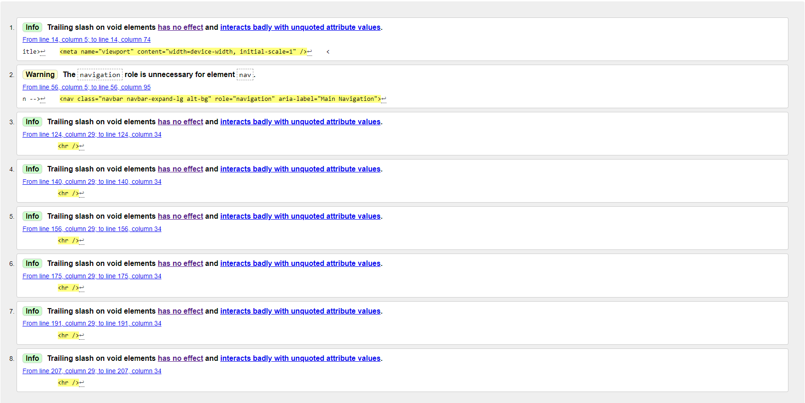
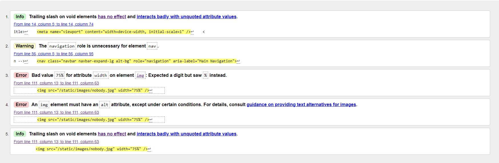
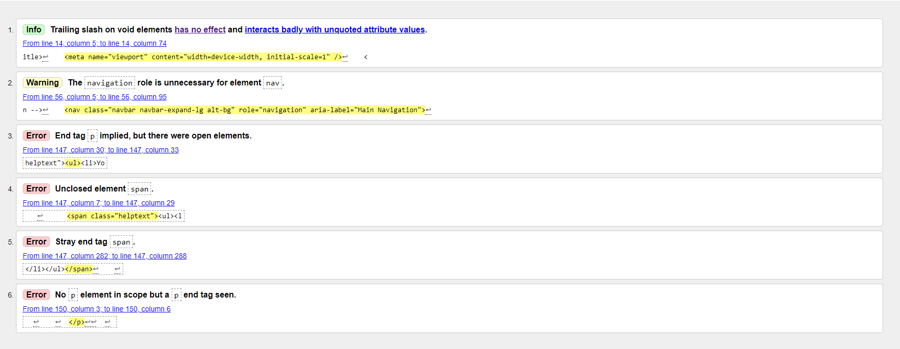
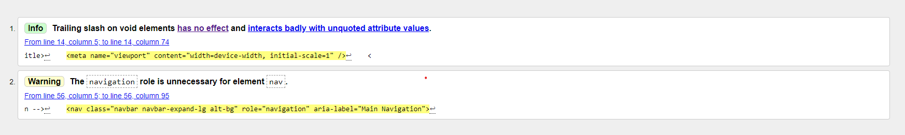
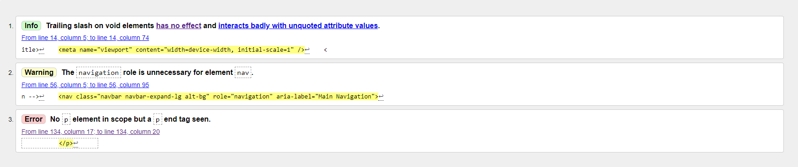
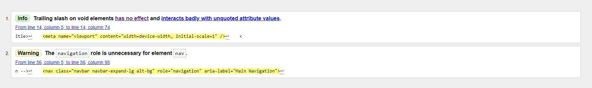
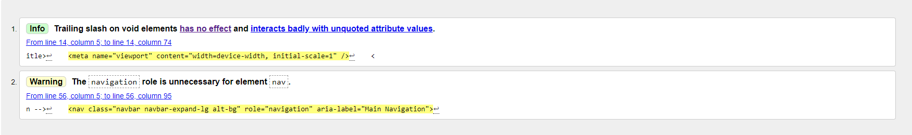
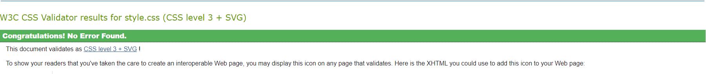
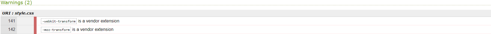

# Manual Testing Documentation

This document contains all the manual testing performed for the blog project. Each test case includes a description, steps to reproduce, expected result, actual result, and status. Beneath this you will find a segment displaying the output of my code validation and error checking.

|Test Case ID|Description                                          |Steps                                                                                                                                                                                                     |Expected Result                                                                                                                                                                                                                                                                                                                                            |Actual Result                                                                                                                                                |Status|
|------------|-----------------------------------------------------|----------------------------------------------------------------------------------------------------------------------------------------------------------------------------------------------------------|-----------------------------------------------------------------------------------------------------------------------------------------------------------------------------------------------------------------------------------------------------------------------------------------------------------------------------------------------------------|-------------------------------------------------------------------------------------------------------------------------------------------------------------|------|
| TC001      | Verify user registration                            | 1. Go to 'Register' page 2. Enter valid details in form 3. Click 'Sign Up' button                                                                                                                        | User should be registered and redirected to the Home page as their new logged in username.                                                                                                                                                                                                                                                                |Outcome as expected                                                                                                                                          | PASS |
| TC002      | Verify user login                                   | 1. Go to 'Login' page 2. Enter valid credentials 3. Click 'Sign in' button                                                                                                                               | User should be logged in and redirected to the Home page with a confirmation message.                                                                                                                                                                                                                                                                     |Outcome as expected                                                                                                                                          |PASS  |
| TC003      | Verify user logout                                  | 1. Log in 2. Click logout button 3. Click 'Sign Out' button on confirmation page.                                                                                                                        | User should be logged out and redirected to the Home page with a confirmation message.                                                                                                                                                                                                                                                                    |Outcome as expected                                                                                                                                          |PASS  |
| TC004      | Verify admin login                                  | 1. Navigate to admin page using /admin extension 2. Log in with superuser credentials                                                                                                                    |Admin should be logged in and redirected to the main admin panel for the site.                                                                                                                                                                                                                                                                             |Outcome as expected                                                                                                                                          |PASS  |
| TC005      | Verify admin creating a blog draft                  | 1. Log in to admin panel 2. Click add button in Blog/Posts section 3. Fill out Post form 4. Select 'Draft' status 5. Click save button                                                                   | Post should be created and visible in the admin panel, but not visible to any users on the website regardless of login status.                                                                                                                                                                                                                            |Outcome as expected                                                                                                                                          |PASS  |
| TC006      | Verify admin publishing a blog draft                | 1. Log in to admin panel 2. Click Posts in Blog section 3. Select draft post 4. Edit 'Status' to 'Published' 5. Click save button                                                                        | Post should be published onto the main site, visible to users regardless of login status.                                                                                                                                                                                                                                                                 |Outcome as expected                                                                                                                                          |PASS  |
| TC007      |Verify admin creating a published blog post          | 1. Log in to admin panel 2. Click add button in Blog/Posts section 3. Fill out Post form 4. Select 'Published' status 5. Click save button                                                               | Post should be published onto the main site, visible to users regardless of login status.                                                                                                                                                                                                                                                                 |Outcome as expected                                                                                                                                          |PASS  |
| TC008      | Verify users viewing a blog post                    | 1. Go to the Home page 2. Click on a post title                                                                                                                                                          | Post details should be displayed, with comments section beneath it.                                                                                                                                                                                                                                                                                       |Outcome as expected                                                                                                                                          |PASS  |
| TC009      | Verify users creating a comment on a blog post      |1. Log in to user account 2. Click on a post 3. Navigate to Comments section beneath post 4. Input comment in 'Leave a comment' box 5. Click 'Submit' button                                              |Comment should appear in Comments section of post, with a notice of it waiting for approval from an admin. Comments needing approval should only be visible to the user, and not public.                                                                                                                                                                   |Outcome as expected                                                                                                                                          |PASS  |
| TC010      |Verify admin approving a comment on a blog post      |1. Log in to admin panel 2. Click Comments in Blog section 3. Click on comment waiting approval 4. Tick 'Approved' 5. Click save button                                                                   |Newly approved comment should now appear publicly on the corresponding blog post, visible to all users whether logged in or not.                                                                                                                                                                                                                           |Outcome as expected                                                                                                                                          |PASS  |
| TC011      |Verify user editing their own comment on a blog post |1. Log in 2. Go to a blog post with your comment on it 3. Click 'edit' button 4. Alter text in comment box 5. Click 'update' button                                                                       |New comment should appear in Comments section on screen, now waiting approval as the content has been altered, comment box should return to new comment submission.                                                                                                                                                                                        |Outcome as expected                                                                                                                                          |PASS  |
| TC012      |Verify user deleting their own comment on a blog post|1. Log in 2. Go to a blog post with your comment on it 3. Click 'delete' button 4.  5. Click confirmation in modal                                                                                        |Deleted comment should be removed from database and no longer visible to users of any permission level, including those not logged in                                                                                                                                                                                                                      |Outcome as expected                                                                                                                                          |PASS  |
| TC013      |Verify responsivity of project pages                 |1. Visit deployed website on mobile device 2. Visit deployed website on Desktop 3. Use Devtools to view site at tablet & laptop resolution 4. Use ui.dev responsive tool to visualise views across devices|For tablet devices or smaller, the navbar should collapse into a burger menu, paginated posts should remain evenly spaced without colliding to fill screen space appropriately, on mobile, posts should be in a single column with others pushed onto later pages. Footer design should remain consistent and compact without overlap or drifting elements.|Outcome as expected                                                                                                                                          |PASS  |
| TC014      |Verify user subscription to email updates            |1. Go to website 2. enter valid email address into form box in page footer 3. click 'Subscribe' button                                                                                                    |User should remain on the page they are on with a confirmation message at the top of the main body of their success.                                                                                                                                                                                                                                       |Outcome as expected                                                                                                                                          |PASS  |
| TC015      |Verify user receives blog post update email          |1. Create new post from admin panel 2. Ensure post is published 3. Check email inbox for new mail with link to post, and link to unsubscribe                                                              |User's subscribed email address should receive a plain email notifying them of the newly published post, it's name, a URL to it, and a URL to unsubscribe from updates.                                                                                                                                                                                    |Outcome as expected                                                                                                                                          |PASS  |
| TC016      |Verify user can unsubscribe from their email update  |1. Create new post from admin panel 2. Ensure post is published 3. Check email inbox for new mail with link 4. Click unsubscribe link 5. Click confirmation button on webpage                             |User's email link should enable them to remove themselves from the mailing list, and receive a confirmation message when redirected to Home page.                                                                                                                                                                                                          |Outcome as expected - Note to be made that future implementation of access to Unsubscribe needs to be made directly from the website itself as well as email.|PASS  |
| TC017      |Verify admin can update About page content           |1. Log in to admin panel 2. Click Abouts in About section 3. Click on existing about section listing 4. Update text content with desired content 5. Click save                                            |Users should see the updated content on the 'About' page of the site, including a timestamp of when the page was updated in the corner of the page's main body.                                                                                                                                                                                            |Outcome as expected                                                                                                                                          |PASS  |
| TC018      |Verify basic page navigation                         |1. Open website 2. Click link in navigation list in header 3. Repeat with each link available                                                                                                             |Users should be directed to the corresponding URL and page for each section of the site listed in the navbar                                                                                                                                                                                                                                               |Outcome as expected                                                                                                                                          |PASS  |

# Validation, Performance, & Errors

Below will display and summarise the various checks and validators used to verify the HTML, CSS, JavaScript, and Python aspects of my project. Where errors are present within code I have not created myself (e.g. Django base code causing flags), I shall acknowledge what appears to be the source, and what I have attempted, or would attempt to do to address this in future deployments.

## Lighthouse Tests

### Home Page

### About Page

### Post View Page

### Signup Page

### Login Page

### Email Subscriber followup page

- The ratings for these pages confirm to me my belief in the consideration of my project's secondary structures, such as alt/aria tags, role labels, and ensuring the presence of indexing for a homepage built from templates that support screen readers and keyboard navigation. The flags shown for the acccessibility category relate to suggestions around how specific my social icons are labelled, and certain other small details such as colour contrast on buttons and how I could further enhance their UX impact on those reliant on support features or with visual impairments. 

- Overall I am satisfied with the outcome of this testing, and will go on to implement the recommended changes where possible following this project to provide a more refined final product in the future that I can consider complete with the acknowledgment of what can make for effective practice surrounding accessibility and SEO going forwards.

# Code Validation

Below will display the results of my HTML, CSS, JavaScript and Python validation, including discussion of any flags or errors and their status as something to be resolved in bugfixes or acknowledged but unaddressed.

## HTML - Nu HTML Checker (W3.org)

### Home page

- **Warning:** The warning listed in this review of the HTML for the base/index code makes mention of an unncessary 'role' tag added to the nav section, which had been included in a basic scan over my work to implement as many accessibility relevant tags as possible to improve user experience. However, I was unaware of the nav feature not needing this addition to still function appropriately for those users, and as such the code has since been removed for the final deployment.

- **Info:** The info flags shown are all tied to a single `
` in which I discovered that for HTML5 standards, the closing slash is not required syntax in this context. As a result, I have altered the tag to now exist as `
`

### About Page

- **Warning:** This is inherited from the base template and has been discussed above, and has been corrected in the final deployment.

- **Errors:** The errors in this case are both tied to the placeholder Author's bio image, of which an alt tag has been added, and for simple resolution when viewing the code, inline styling has been created by modifying the line to `style="width:75%`. If the editing required was of greater scope, styling this way would be avoided and simply added to the stylesheet for the page. However, given the brief and limited impact it has overall, this solution does not appear as a harmful coding practice for this context as long as it is acknowledged as not a long term solution if styling needs were greater for the image in question. Finally, trailing slashes have been removed from the appropriate code lines where they are not required by HTML5 standards, as their inclusion only catered to xhtml compatability, which I do not currently need.

### Signup Page

- **Warning/Info:** This is inherited from the base template and has been discussed above, and has been corrected in the final deployment.

- **Errors:** The errors tied to the highlighted `` and `
` tags have been searched for but do not appear within my own code. This concludes that they are as a result of one of my django imported applications. I have tried to locate the appropriate files in my libraries but could not locate the source of the issue. If/when such a file is found, this fix can be experimented with to allow for correct source code without damaging the functionality of any features provided.

### Login Page

- **Warning/Info:** This is inherited from the base template and has been discussed above, and has been corrected in the final deployment.

### Post View Page

- **Warning/Info:** This is inherited from the base template and has been discussed above, and has been corrected in the final deployment.

- **Errors:** This `
` tag error is a result of a django code implementation that I cannot find the source of, as it does not stem from my written code. As mentioned with prior cases of this issue, if/when a responsible file is located, this issue can be attempted to be resolved, but fortunately does not appear impactful to the webpage itself.

### Subscribe (landing form page)

- **Warning/Info:** This is inherited from the base template and has been discussed above, and has been corrected in the final deployment.

### Unsubscribe Page

- **Warning/Info:** This is inherited from the base template and has been discussed above, and has been corrected in the final deployment.

### Logout Page

- **Warning/Info:** The continual issues shown in prior images that align here are inherited from the base template and have been corrected in the final deployment. Those new flags regarding a `
` tag are a result of django implemented code and does not exist within my written code. Once the source has been identified this issue can be resolved by removing the slash, but the only impact is on providing xhtml compatability so I do not deem this an active problem with the page or it's functions.

## CSS - Jigsaw (w3.org)

- As shown above, my css stylesheet passes validaton checks, requiring no correction.

- These two warnings are the only feedback provided, however these are circumstancial as it just to ensure that the appropriate packages/services are present in the directory to enable use of third party extensions. In the case of this project, this is not a problem, and as such can be considered reviewed, yet disregarded.