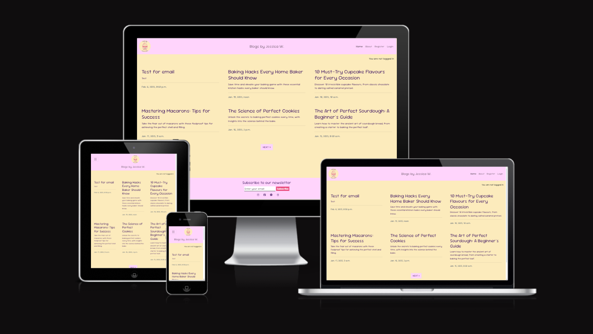

# Blogs by Jessica W - A capstone Django Project

## Overview
Blogs by Jesscica W is a simplistic, MVP standard web app designed as a blog site to act as a social/community extension of the Cakesbyjessicaw independent baking business created by my partner as a way to turn a hobby into a self sustaining passion project. This inspired me to theme my blog around this with the idea being to bring individuals both to the business, and to form a community around that in which other people can gain inspiration and insights around baking of all kinds, all in a digestible and friendly format.

## UX Design Process
- **Link to User Stories in GitHub Projects:**
  - [GitHub Projects Kanban Board](https://github.com/users/jackgroves2024/projects/3)
- **Wireframes:**
  - [Wireframe Images Here](https://github.com/jackgroves2024/capstone-cakeblog/tree/main/WIREFRAMES%20FOR%20CAPSTONE)
  -  The navigation is simplistic and visually streamlined to keep the pages readable and simple to understand. The overall aim was to avoid clutter whilst providing prominent enough content and interactivity that enhances user experience. Each wireframe was built with consistency in mind as the app's different pages are supposed to appear as extensions of the 'hub' that is the home page.
- **Design Rationale:**
  - The colour theme was not determined on the wireframes but has been chosen based on the Cakesbyjessicaw business logo and existing designs used in promotional material, branding, and social media icons. The import font family used provides a soft readable set of characters that still feel fitting for the 'comfortable theme' of the overall app without compromising the experience's accessibility. The app's core features and general structure is dependent on the organisation and responsivity that Bootstrap5 provides, from the paginated card layout to the appearance of the various forms present. It has kept things dynamic and accessible across devices by enabling a mobile first development approach.
  - [Highlight any considerations made for users with disabilities, such as screen reader support.]
- **Reasoning For Any Final Changes:**
  - [Summarise significant changes made to the design during development and the reasons behind them.]
  - [Reflect on how these changes enhance inclusivity and accessibility.]

## Key Features
- **User Account System:** A secure registration system for users to create accounts to enable interactions with blog posts they can view. Users can login/logout on demand, with access to CRUD features of their personal content protected behind login. Users can opt to add their email to their account when creating it, and user passwords have minimum requirements to ensure strong security implementation for each account's details.
- **Feature 2:** [Briefly describe the implemented feature.]
- **Inclusivity Notes:** 
  - [Mention how the features address the needs of diverse users, including those with SEND.]

## Deployment
- **Platform:** Heroku
- **High-Level Deployment Steps:** 
  1. Clone the repository: `git clone https://github.com/jackgroves2024/capstone-cakeblog.git`
  2. Set up the Heroku environment with a PostgreSQL database.
  3. Configure environment variables for sensitive data (e.g., secret keys, STMP server keys).
  4. Deploy using Heroku Git or GitHub integration.
- **Verification and Validation:**
  - I have deployed and compared the heroku app to my local test environment to verify the consistency in function and design (e.g. ensuring static files are served correctly.)
  - I have also compared the visual readability matches on the deployment and local server across different device screen sizes to ensure responsive user experience is appropriate for users with accessibility needs, such as limited sight, colour blindness, etc.
- **Security Measures:**
  - Use of environment variables for sensitive data being kept out of the raw code, added to the config vars section of the Heroku App Dashboard.
  - `DEBUG MODE` set to `False` for deployed versions of the app for security benefit.
  - `env.py` file used to store sensitive information in local repository, added to .gitignore to remain hidden from public view.

## AI Implementation and Orchestration

### Use Cases and Reflections:

  - **Code Creation:** 
    - Reflection: Having access to copilot's extension with VSCode proved to be a major asset in enhancing the quality and pacing of my produced work, thanks to it's assistance in quickly producing simple starter code, such as HTML boilerplate, auto completion of lines based on the context of my work, and allowing me to quickly make comments within my code to enhance the readability and identification of my work's function throughout various files. For heavier use in production, accessing the chat to receive step by step guidance enabled me to identify a starting point in what I wished to create or achieve, with each step breaking down the code to allow me to ensure my own understanding of it before choosing to implement it into my workspace.

    - Key Example - Mail System: Step by step production using the chat feature assisted me in constructing my Email Update system, as I was unfamiliar with the processes required in the backend to enable functionality of a feature that acts mainly on an external environment, being the emails sent out themselves. I had no prior knowledge of where to begin, but was then able to learn about the existence and implementation of STMP servers and handling them securely to prevent leaking of sensitive information.
  - **Debugging:** 
    - Reflection: Key interventions included resolving logic errors and enhancing maintainability, with a focus on simplifying complex logic to make it accessible.
  - **Performance and UX Optimization:** 
    - Reflection: Minimal manual adjustments were needed to apply AI-driven improvements, which enhanced application speed and user experience for all users.

- **Overall Impact:**
  - AI tools streamlined repetitive tasks, enabling focus on high-level development.
  - Efficiency gains included faster debugging, comprehensive testing, and improved code quality.
  - Challenges included contextual adjustments to AI-generated outputs, which were resolved effectively, enhancing inclusivity.

## Testing Summary
- **Manual Testing:**
  - **Devices and Browsers Tested:** Windows 11, Android 14, Google Chrome, Opera GX, Samsung Browser, Microsoft Edge
  - **Features Tested:** All main site features were manually tested, including navigation, CRUD operations, and User/Admin Authentication
  - **Results:** [Summarise testing results, e.g., "All critical features worked as expected, including accessibility checks."]

## Future Enhancements
- [List potential improvements or additional features for future development.]
- Consider enhancements to improve accessibility further, such as voice input capabilities or additional language support.
